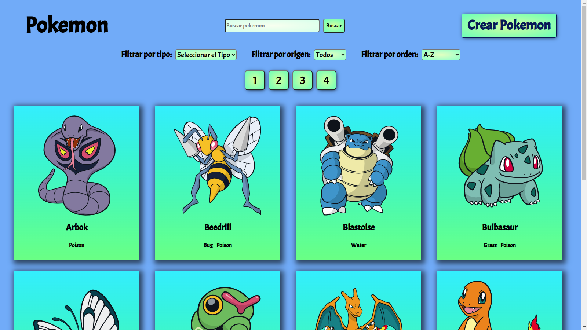
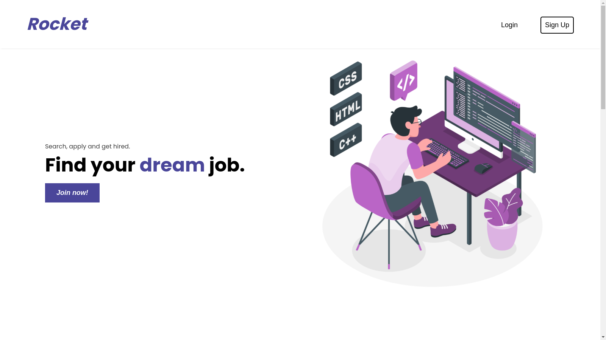
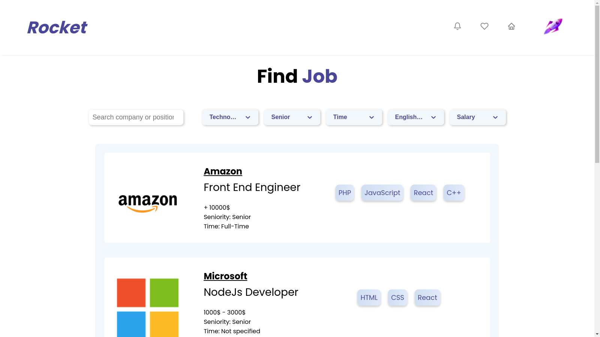
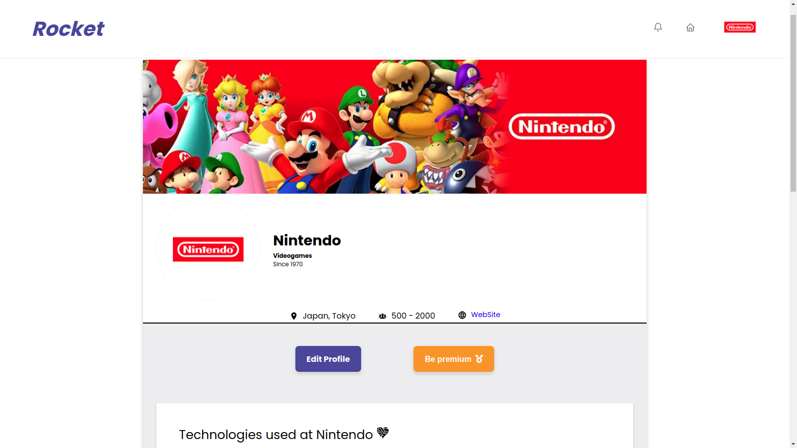
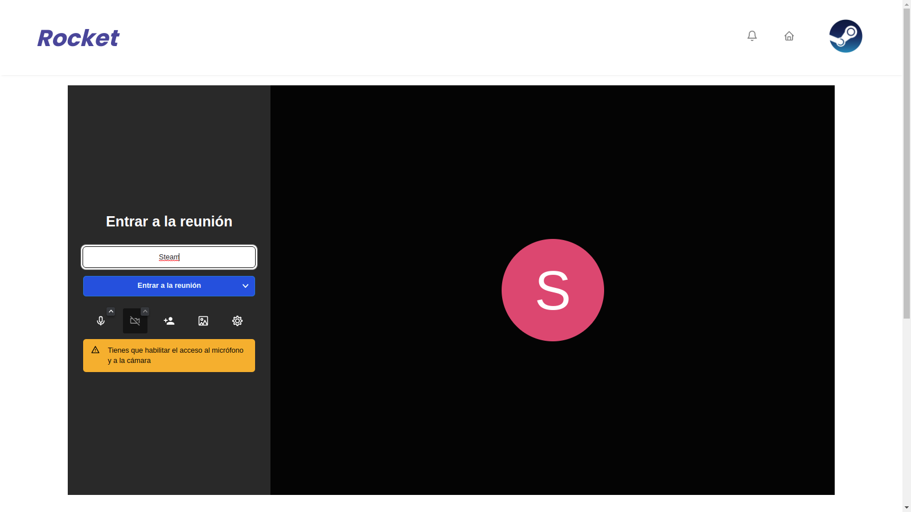
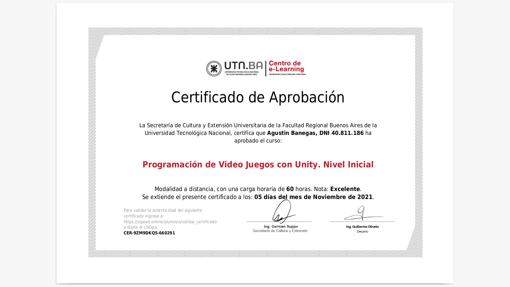
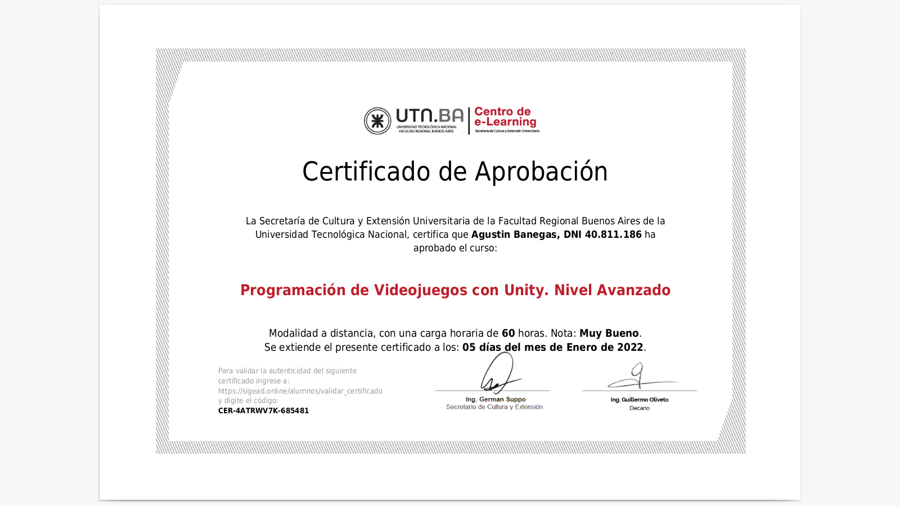

## Buenas! Soy Agustin, desarrollador Web Full Stack de Buenos Aires, Argentina. 👋

Me considero proactivo, curioso, de escucha activa, siempre buscando la base de los problemas y la manera de resolverlos, me gusta estar constantemente aprendiendo y transmitir ese conocimiento al equipo.

Mis inicios en la programación fueron en el secundario donde tuve una base de programación en C y PLC, ademas de haber adquirido bases en electrónica.
En el 2021 realice un curso de desarrollo de videojuegos en Unity en la UTN y al finalizarlo ingrese a Henry donde me capacite como desarrollador Full Stack.

### Mis tecnologías: HTML, CSS, JavaScript, SQL, GitHub, Node.js, React, Redux, Express, Unity.

  **Mi primer proyecto** en desarrollo Web fue mi PI en Henry:
  <a href="https://pi-pokemon-wheat.vercel.app/">Link al proyecto</a>

 

Mi **proyecto final en Henry** fue hacer una **pagina que facilite la busqueda laboral** tanto para usuarios como para empresas, teniendo la posibilidad el usuario de mandar su cv a la oferta creada por la empresa y que esta le responda con una invitacion a una entrevista por videollamada dentro de la misma pagina.
<a href="https://proyecto-final-nu.vercel.app/">Link al proyecto</a>

  
  

  
  

 

### Mis certificados:

  
  

 

### Si me queres contactar podes hacerlo en:

  
  <a href="https://www.linkedin.com/in/agusbanegas/">Linkedin</a>

  
  <a href="mailto:agusezeq@gmail.com">agusezeq@gmail.com</a>

